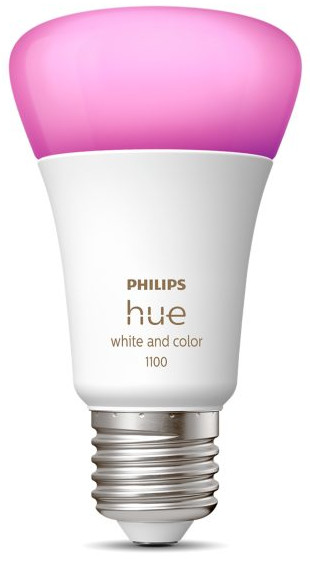

# PhilipsHue

- [PhilipsHue](#philipshue)
  - [Présentation](#présentation)
  - [La maquette](#la-maquette)
  - [Application Hue](#application-hue)
  - [Prise en main](#prise-en-main)
    - [OpenHue API](#openhue-api)
    - [OpenHue CLI](#openhue-cli)
    - [Outils CLI](#outils-cli)
    - [Postman](#postman)
    - [Application cliente](#application-cliente)
  - [Boutique](#boutique)
  - [Auteurs](#auteurs)

---

## Présentation

Philips fut fondé par Gerhard et Frederik Philips à Eindhoven en 1891 avec la production d'ampoules à filament de charbon.

Philips Hue est une sous-marque qui fait partie de la famille Philips et elle est dédiée à l’éclairage connecté.

> La sous-marque Philips Lighting est devenu [Signify](https://www.signify.com/fr-fr). Les produits Philips Hue existent depuis 2013.

Pionnier dans le secteur de l'éclairage connecté, Philips Hue est devenu un écosystème propriétaire de gestion de produits connectés ([Domotique](https://fr.wikipedia.org/wiki/Domotique)) communiquant en [ZigBee](https://fr.wikipedia.org/wiki/ZigBee).

Pionnier dans le secteur de l'éclairage connecté, Philips Hue dispose d'une gamme importante d'ampoules et de luminaires qui communiquent en [ZigBee](https://fr.wikipedia.org/wiki/ZigBee).

> [!TIP]
> Les lumières Philips Hue peuvent aussi être contrôlées via [Bluetooth](https://fr.wikipedia.org/wiki/Bluetooth) pour obtenir un ensemble limité de fonctionnalités.

L'utilisation du [ZigBee](https://fr.wikipedia.org/wiki/ZigBee) nécessite la présence d'une passerelle nommée « pont de connexion » (_Hue Bridge_). Un pont (ou _hub_) Hue Bridge peut supporter jusqu’à 50 ampoules.

> Le pont Philips Hue Bridge prend en charge [Matter](https://fr.wikipedia.org/wiki/Matter_(standard)).

## La maquette

La maquette de test est composé :

- d'une passerelle _Hue Bridge_


- de trois ampoules Hue White and Color Ambiance A60 E27 9W



- d'un Hue Motion Sensor détecteur de mouvement


- d'un Hue Dimmer switch télécommande nomade et variateur de Lumière


Il faut commencer par installer le pont Hue puis les appareils en suivant les instructions fournies par Philips.

## Application Hue

L'application principale du système Philips Hue vous permet d'allumer et d'éteindre vos lumières, de créer des automatisations et des minuteries, de synchroniser vos éclairages avec votre TV et votre musique, de contrôler votre système de sécurité connectée pour la maison.

> [!IMPORTANT]
> L'application Hue va aussi permettre de mettre à jour la version logicielle du pont Hue. Il est conseillé de la faire.

Liens :

- [Android](https://play.google.com/store/apps/details?id=com.philips.lighting.hue2)
- [iOS](https://apps.apple.com/us/app/philips-hue-gen-2/id1055281310?ls=1)

> [!WARNING]
> Il faudra trouver l'application en fonction de la version Android : https://philips-hue.fr.uptodown.com/android/versions

Philips Hue fonctionne avec de nombreux appareils, plates-formes et assistants pour une maison connectée :

- [Amazon Alexa](https://www.philips-hue.com/fr-fr/explore-hue/works-with/amazon-alexa)
- [Assistant Google](https://www.philips-hue.com/fr-fr/explore-hue/works-with/the-google-assistant)
- [Apple Home et Siri](https://www.philips-hue.com/fr-fr/explore-hue/works-with/apple-homekit)

> Les applications compatibles avec Philips Hue : https://www.philips-hue.com/fr-fr/explore-hue/works-with

## Prise en main

Une fois la mise à jour logicielle du pont Hue réalisée, il faut déterminer son adresse IP sur le réseau :

```bash
$ curl -k --location https://discovery.meethue.com/
[{"id":"XXXXXXXXXXXXXXXX","internalipaddress":"192.168.52.182","port":443}]
```

> Sinon, il faudra utiliser wireshark.

On peut alors obtneir une description du pont Hue :

```bash
$ curl -k --location  http://192.168.52.182/description.xml
```

```xml
<root>
    <specVersion>
        <major>1</major>
        <minor>0</minor>
    </specVersion>
    <URLBase>http://192.168.52.182:80/</URLBase>
    <device>
        <deviceType>urn:schemas-upnp-org:device:Basic:1</deviceType>
        <friendlyName>Philips hue (192.168.52.182)</friendlyName>
        <manufacturer>Signify</manufacturer>
        <manufacturerURL>http://www.meethue.com</manufacturerURL>
        <modelDescription>Philips hue Personal Wireless Lighting</modelDescription>
        <modelName>Philips hue bridge 2015</modelName>
        <modelNumber>BSB002</modelNumber>
        <modelURL>http://www.meethue.com</modelURL>
        <serialNumber>ecb5fa923aad</serialNumber>
        <UDN>uuid:2f402f80-da50-11e1-9b23-ecb5fa923aad</UDN>
        <presentationURL>index.html</presentationURL>
        <iconList>
            <icon>
                <mimetype>image/png</mimetype>
                <height>48</height>
                <width>48</width>
                <depth>24</depth>
                <url>hue_logo_0.png</url>
            </icon>
        </iconList>
    </device>
</root>
```

> On obtient par exemple l'adresse MAC du pont Hue, ici : `ec:b5:fa:92:3a:ad`

### OpenHue API

Liens :

- [API OpenHue](https://github.com/openhue/openhue-api)
- [Spécification OpenHue](https://www.openhue.io/api/openhue-api) et [Hue CLIP API](https://editor.swagger.io/?url=https://api.redocly.com/registry/bundle/openhue/openhue/v2/openapi.yaml)

OpenHue API est un projet open source qui fournit une spécification complète pour l'API Philips Hue REST. Elle permettra de développer des applications clientes pour exploiter une installation de matériels Hue.

Télécharger le fichier de spécification `openapi.yaml` :

```bash
$ wget -c --output-document openapi.yaml 'https://api.redocly.com/registry/bundle/openhue/openhue/v2/openapi.yaml?branch=main&download'

$ ls -l openapi.yaml
-rw-rw-r-- 1 tv tv 120480 févr.  6 07:32 openapi.yaml
```

> Ce fichier pourra être utilisé par une application comme [Postman](https://www.postman.com/).

### OpenHue CLI

Il existe un outil en ligne de commande [OpenHue CLI](https://www.openhue.io/cli/openhue-cli) (https://www.openhue.io/cli/openhue-cli) disponible via [brew](https://brew.sh/fr/) ou [docker](https://hub.docker.com/r/openhue/cli).

- [brew](https://brew.sh/fr/)

```bash
$ /bin/bash -c "$(curl -fsSL https://raw.githubusercontent.com/Homebrew/install/HEAD/install.sh)"

$ brew tap openhue/cli
$ brew install openhue-cli
```

```bash
$ openhue help

openhue controls your Philips Hue lighting system

    Find more information at: https://www.openhue.io/cli

Usage:
  openhue [command]

Configuration
  config      Manual openhue CLI setup
  discover    Hue Bridge discovery
  setup       Automatic openhue CLI setup

Philips Hue
  get         Display one or many resources
  set         Set specific features on resources

Additional Commands:
  completion  Generate the autocompletion script for the specified shell
  help        Help about any command
  version     Print the version information

Flags:
  -h, --help   help for openhue

Use "openhue [command] --help" for more information about a command.
```

Il faut commencer par s'authentifier pour obtenir une clé API :

```bash
$ openhue setup
[OK] Found Hue Bridge with IP '192.168.52.182'
[..] Please push the button on your Hue Bridge
......
[OK] Successfully paired openhue with your Hue Bridge!
[OK] Configuration saved in file $HOME/.openhue/config.yaml
```

La clé (_key_) de l'API est stocké dans le fichier `$HOME/.openhue/config.yaml` :

```bash
$ cat $HOME/.openhue/config.yaml
bridge: 192.168.52.182
key: LiG7XXXXXXXXXXXXXXXXXXXXXXXXXXXXXXXXvZ8f
```

Ensuite, il est possible d'interroger le pont Hue :

```bash
$ openhue get lights
...
```

- [docker](https://hub.docker.com/r/openhue/cli)

```bash
$ docker pull openhue/cli

$ docker run -v "${HOME}/.openhue:/.openhue" --rm -it --name=openhue openhue/cli help
...

$ docker run -v "${HOME}/.openhue:/.openhue" --rm -it --name=openhue openhue/cli setup --bridge 192.168.52.182
...

$ docker run -v "${HOME}/.openhue:/.openhue" --rm -it --name=openhue openhue/cli get lights
```

### Outils CLI

Il est évidemment d'interagir avec le pont Hue tout simplement avec les commandes `curl` ou `wget`.

Il faut commencer par s'authentifier pour obtenir une clé API :

```bash
$ curl -k --location 'https://192.168.52.182/api' --header 'Content-Type: application/json' --header 'Accept: application/json' --data '{
  "devicetype": "openhue-bts",
  "generateclientkey": true
}'
[{"error":{"type":101,"address":"","description":"link button not pressed"}}]
```

Il faut tout d'abord appuyer sur le bouton du pont Hue :

```bash
$ curl -k --location 'https://192.168.52.182/api' --header 'Content-Type: application/json' --header 'Accept: application/json' --data '{
  "devicetype": "openhue-bts",
  "generateclientkey": true
}'
[{"success":{"username":"XXXXXXXX","clientkey":"YYYYYYYY"}}]
```

> [!IMPORTANT]
> La clé d'API a utilisé par la suite dans les requêtes est la valeur de `username` !

On peut maintenant interroger le pont Hue en utilisant l'API. Pour cela, on aura besoin de connaître les détails de la spécification de l'API :

- [Spécification OpenHue](https://www.openhue.io/api/openhue-api)
- [Hue CLIP API](https://editor.swagger.io/?url=https://api.redocly.com/registry/bundle/openhue/openhue/v2/openapi.yaml)

On peut commencer par récupérer l'ensemble des ressources :

```bash
$ curl -k --location 'https://192.168.52.182/clip/v2/resource' --header 'Accept: application/json' --header 'hue-application-key: XXXXXXXX'
```

La liste des éclairages :

```bash
$ curl -k --location 'https://192.168.52.182/clip/v2/resource/light' --header 'Accept: application/json' --header 'hue-application-key: XXXXXXXX'
```

Obtenir les détails d'un éclairage avec son identifiant `{lightId}` :

```bash
curl -k --location 'https://192.168.52.182/clip/v2/resource/light/f9a9b376-6738-4bd1-81ce-021e2ee56a82' --header 'Accept: application/json' --header 'hue-application-key: XXXXXXXX'

wget --no-check-certificate --quiet --method GET --timeout=0 --header 'Accept: application/json' --header 'hue-application-key: XXXXXXXX' 'https://192.168.52.182/clip/v2/resource/light/f9a9b376-6738-4bd1-81ce-021e2ee56a82'
```

En utilisant une requête `PUT`, il sera alors possible de mettre à jour l'état d'un éclairage, ici `ON/OFF` :

```bash
$ wget --no-check-certificate --quiet  --method PUT  --timeout=0   --header 'Content-Type: application/json'   --header 'Accept: application/json'   --header 'hue-application-key: XXXXXXXX' --body-data '{  "on": {    "on": false  }}'    'https://192.168.52.182/clip/v2/resource/light/f9a9b376-6738-4bd1-81ce-021e2ee56a82'

$ wget --no-check-certificate --quiet  --method PUT  --timeout=0   --header 'Content-Type: application/json'   --header 'Accept: application/json'   --header 'hue-application-key: XXXXXXXX' --body-data '{  "on": {    "on": true  }}'    'https://192.168.52.182/clip/v2/resource/light/f9a9b376-6738-4bd1-81ce-021e2ee56a82'
```

### Postman

[Postman](https://fr.wikipedia.org/wiki/Postman_(logiciel)) est une plateforme pour la construction, l'utilisation et les tests d'API.

Lien : https://www.postman.com/

Télécharger et installer la version de [Postman](https://dl.pstmn.io/download/latest/linux_64) pour Linux : https://dl.pstmn.io/download/latest/linux_64

Ou à partir du gestionnaire de paquets _snap_ :

```bash
$ sudo snap install postman
```


Créer un compte si nécessaire (ici, `campus-btssn-avignon`).

Il existe aussi un outil en ligne de commande Postman CLI :

```bash
$ curl -o- "https://dl-cli.pstmn.io/install/linux64.sh" | sh
```

> Il existe une extension pour Visual Studio Code : https://marketplace.visualstudio.com/items?itemName=Postman.postman-for-vscode

Créer un nouvel environnement avec ces deux variables :

- `baseUrl` avec comme valeur initiale et courante l'adresse du pont Hue, par exemple : `https://192.168.52.182`
- `apiKey` avec comme valeur initiale et courante la valeur `username` obtenue ou à obtenir par une phase d'authentification


### Application cliente

## Boutique

- [Philips Hue](https://www.philips-hue.com/fr-fr/products/)
- [Amazon](https://www.amazon.fr/stores/PhilipsHue/page/1D8D599B-E9F3-4C60-971C-276FC75625AB)

## Auteurs

- Jérôme BEAUMONT <<beaumontlasalle84@gmail.com>>
- Thierry VAIRA <<thierry.vaira@gmail.com>>

---
&copy; 2024 LaSalle Avignon
